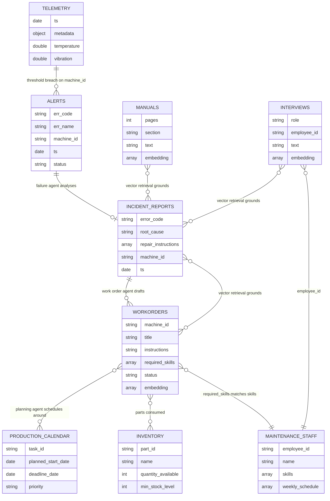

# EDD — Entity Document Diagram

MongoDB data model for the Agentic Predictive Maintenance demo.

Database: `agentic_predictive_maintenance` (configurable via `DATABASE_NAME`)

Field types below were derived from the seeded documents and the runtime writes,
not from a formal schema — this application defines no JSON Schema validators.

---

## Entity overview

| Collection | Written by | Read by | Vector index |
| --- | --- | --- | --- |
| `telemetry` | Simulator (time series) | Failure agent, telemetry chart | — |
| `alerts` | Simulator threshold check | Failure agent, Alerts list | — |
| `incident_reports` | Failure agent | Work order agent, UI | — |
| `workorders` | Work order agent + seed | Planning agent, vector retrieval | `default` |
| `manuals` | Seed | Failure agent (vector retrieval) | `default` |
| `interviews` | Seed | Failure agent (vector retrieval) | `default` |
| `inventory` | Seed | Work order agent | — |
| `maintenance_staff` | Seed | Planning agent | — |
| `production_calendar` | `generate_calendar` | Planning agent | — |
| `checkpoints`, `checkpoint_writes` | LangGraph checkpointer | LangGraph | — |

---

## `telemetry`

Time series collection. Created by [scripts/seed.mjs](./scripts/seed.mjs) with
`timeField: ts`, `metaField: metadata`, `granularity: minutes`, and
`expireAfterSeconds: 86400` — **documents self-delete after 24 hours.**

| Field | Type | Notes |
| --- | --- | --- |
| `_id` | ObjectId | |
| `ts` | date | Time field |
| `metadata` | object | Meta field |
| `metadata.factory_id` | string | |
| `metadata.machine_id` | string | e.g. `M1` |
| `metadata.prod_line_id` | string | |
| `temperature` | double | °C |
| `vibration` | double | mm/s |

Index: `metadata_1_ts_1` (implicit time series index).

## `alerts`

Raised by [src/lib/simulation/failureDetection.js](./src/lib/simulation/failureDetection.js)
when telemetry crosses a threshold (temperature > 90 → `E12`, vibration > 1.2 → `E13`).

| Field | Type | Notes |
| --- | --- | --- |
| `_id` | ObjectId | |
| `err_code` | string | `E12` \| `E13` |
| `err_name` | string | `High temperature` \| `High vibration` |
| `machine_id` | string | |
| `details.temperature` | double | Reading at trigger time |
| `details.vibration` | double | Reading at trigger time |
| `ts` | date | |
| `status` | string | `new` when created |

## `incident_reports`

Generated by the failure agent from retrieved manuals, work orders, and interviews.

| Field | Type | Notes |
| --- | --- | --- |
| `_id` | ObjectId | |
| `error_code` | string | Mirrors `alerts.err_code` |
| `error_name` | string | Mirrors `alerts.err_name` |
| `root_cause` | string | LLM-generated analysis |
| `repair_instructions` | array\<object\> | Ordered steps |
| `repair_instructions[].step` | int | 1-based |
| `repair_instructions[].description` | string | |
| `machine_id` | string | |
| `ts` | date | |

## `workorders`

Seeded history plus agent-generated orders. Embedded for vector retrieval.

| Field | Type | Notes |
| --- | --- | --- |
| `_id` | ObjectId | |
| `machine_id` | string | |
| `title` | string | Embedded |
| `instructions` | string | Embedded |
| `estimated_duration` | string | Free text, e.g. `3 hours` — not a number |
| `proposed_start_time` | string | ISO-8601 **string**, not a BSON date |
| `required_skills` | array\<string\> | Matched against `maintenance_staff.skills` |
| `observations` | string | Embedded |
| `root cause` | string | ⚠️ Field name contains a space — see Known inconsistencies |
| `status` | string | e.g. `completed` |
| `created_at` | object | ⚠️ Stored as `{ $date: … }`, not a BSON date |
| `embedding` | array\<double\> | 1024 dims |

Vector index `default`: `embedding`, cosine, 1024 dimensions.

## `manuals`

| Field | Type | Notes |
| --- | --- | --- |
| `_id` | ObjectId | |
| `pages` | int | |
| `section` | string | Embedded |
| `text` | string | Embedded |
| `embedding` | array\<double\> | 1024 dims |

Vector index `default`: `embedding`, cosine, 1024 dimensions.

## `interviews`

Technician interview transcripts — the tacit-knowledge source for root-cause analysis.

| Field | Type | Notes |
| --- | --- | --- |
| `_id` | ObjectId | |
| `role` | string | e.g. `Senior Technician` |
| `employee_id` | string | Logical ref to `maintenance_staff.employee_id` |
| `creation_date` | object | ⚠️ Stored as `{ $date: … }`, not a BSON date |
| `type` | string | e.g. `maintenance` |
| `text` | string | Embedded |
| `embedding` | array\<double\> | 1024 dims |

Vector index `default`: `embedding`, cosine, 1024 dimensions.

## `inventory`

| Field | Type | Notes |
| --- | --- | --- |
| `_id` | ObjectId | |
| `part_id` | string | e.g. `P-001` |
| `name` | string | |
| `description` | string | |
| `quantity_available` | int | |
| `min_stock_level` | int | Reorder threshold |
| `lead_time_days` | int | |
| `location` | string | |
| `unit_cost` | double | |
| `last_updated` | object | ⚠️ Stored as `{ $date: … }`, not a BSON date |

## `maintenance_staff`

| Field | Type | Notes |
| --- | --- | --- |
| `_id` | ObjectId | |
| `employee_id` | string | e.g. `EMP-1001` |
| `name` | string | |
| `role` | string | |
| `skills` | array\<string\> | Matched against `workorders.required_skills` |
| `weekly_schedule` | array\<object\> | Per-day availability |
| `weekly_schedule[].day` | string | |
| `weekly_schedule[].full_day` | bool | |
| `weekly_schedule[].coverage` | string | |
| `weekly_schedule[].shifts` | array\<object\> | Shift windows |

## `production_calendar`

Regenerated wholesale by `npm run generate_calendar <months>`.

| Field | Type | Notes |
| --- | --- | --- |
| `_id` | ObjectId | |
| `task_id` | string | e.g. `PROD-0121` |
| `task_type` | string | e.g. `production` |
| `initial_start_date` | date | |
| `planned_start_date` | date | Shifted when maintenance is scheduled |
| `planned_end_date` | date | |
| `deadline_date` | date | |
| `duration` | int | Days |
| `delay_factor` | double | |
| `priority` | string | `high` \| … |
| `pieces_to_produce` | int | |

## `checkpoints` / `checkpoint_writes`

Managed by `@langchain/langgraph-checkpoint-mongodb`. Treat as opaque —
do not hand-edit. Keyed by `thread_id` / `checkpoint_id`, payloads are BSON `Binary`.

---

## Relationships

All relationships are **logical only** — there are no foreign keys, no schema
validators, and no indexes beyond `_id` and the time series index.

---

## Known inconsistencies

These are present in the current code and data. Documented here so agents model
reality rather than the intended design.

1. **`workorders.root cause` contains a space.** Every other collection uses
   snake_case (`incident_reports.root_cause`). Critically,
   [scripts/config.js](./scripts/config.js) lists `root_cause` in the
   `workorders` `textFields`, so
   [scripts/embed_collections.mjs](./scripts/embed_collections.mjs) resolves
   `doc["root_cause"]` to `undefined` and substitutes `""` — **root-cause text is
   silently excluded from the work order embeddings.**

2. **Extended JSON dates are stored as nested objects.**
   [scripts/seed.mjs](./scripts/seed.mjs) uses `JSON.parse` on `data/*.json`,
   which leaves `{"$date": "…"}` as a plain object instead of converting it to a
   BSON date. This affects `interviews.creation_date`, `inventory.last_updated`,
   and `workorders.created_at`. Date range queries on those fields will not work.
   The API route at [src/app/api/action/[action]/route.js](./src/app/api/action/%5Baction%5D/route.js)
   already uses `EJSON.parse` correctly — the seed script does not.

3. **`workorders.proposed_start_time` and `estimated_duration` are strings**
   (`"2025-04-10T08:00:00.000Z"`, `"3 hours"`), so they cannot be sorted or
   compared as dates/durations without conversion.
