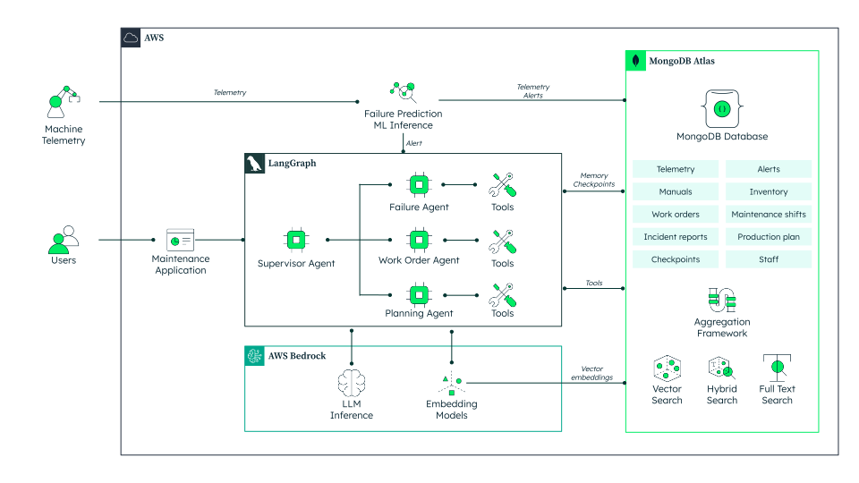

# Agentic Predictive Maintenance System

Manufacturers are moving beyond traditional predictive maintenance—it's not just about forecasting failures, but about acting on issues instantly and autonomously. This project demonstrates how agentic AI, orchestrated by LangGraph.js and powered by MongoDB Atlas and AWS Bedrock, enables multi-agent systems that detect problems and coordinate rapid, intelligent responses across the shop floor.

This demo showcases:

- **Autonomous action:** AI agents diagnose, plan, and execute maintenance tasks in real time, minimizing human intervention and downtime.
- **Operational agility:** The system adapts to new data, equipment, and workflows, supporting continuous improvement.
- **Unified, scalable data foundation:** MongoDB makes it easy to build, operate, and evolve agentic AI solutions—handling diverse data, enabling fast search, and supporting real-time decision-making.

## Architecture



**How it works:**

1. **Detection:** Agents monitor machine telemetry and logs, triggering alerts on anomalies.
2. **Diagnosis:** The Failure Agent uses MongoDB’s flexible data model and vector search to rapidly analyze root causes.
3. **Action:** The Work Order Agent drafts and routes maintenance tasks, leveraging historical data and inventory.
4. **Optimization:** The Planning Agent schedules work to minimize disruption, using real-time production and staff data.

**Why MongoDB?**

- **Unified data layer:** Handles structured, unstructured, and time series data for all agents and workflows.
- **Real-time search & retrieval:** Atlas Search and vector search enable fast, context-rich decision-making.
- **Scalable, adaptable foundation:** Easily extend to new agents, data sources, and operational needs.

This architecture lets manufacturers automate not just prediction, but coordinated action—unlocking the next level of operational excellence.

## Getting Started

### Prerequisites

- Node.js 18+
- MongoDB (local or Atlas)
- AWS Account with Bedrock access

### Setup

1. Clone the repository
2. Install dependencies:
   ```bash
   npm install
   ```
3. Copy the example environment file and configure it:
   ```bash
   cp .env.example .env.local
   ```
4. Add the following environment variables to your `.env.local` file and update the values as needed:
   ```env
   MONGODB_URI="<your-mongodb-uri>"
   DATABASE_NAME="agentic_predictive_maintenance"
   AWS_REGION="us-east-1"
   AWS_PROFILE="default"
   COMPLETION_MODEL="us.anthropic.claude-3-5-haiku-20241022-v1:0"
   EMBEDDING_MODEL="cohere.embed-english-v3"
   ```
5. Update the `.env.local` file with your MongoDB and AWS credentials.
6. Run the development server:
   ```bash
   npm run dev
   ```

Open [http://localhost:3000](http://localhost:3000) with your browser to see the result.
