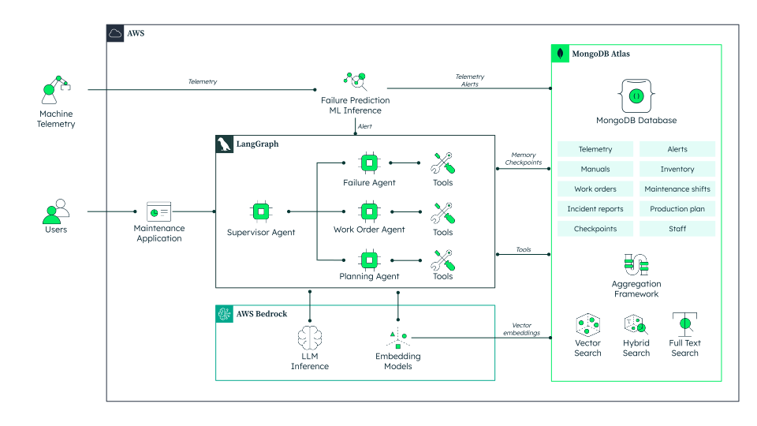

# Agentic Predictive Maintenance System

Manufacturers are moving beyond traditional predictive maintenance—it's not just about forecasting failures, but about acting on issues instantly and autonomously. This project demonstrates how agentic AI, orchestrated by LangGraph.js and powered by MongoDB Atlas and AWS Bedrock, enables multi-agent systems that detect problems and coordinate rapid, intelligent responses across the shop floor.

This demo showcases:

- **Autonomous action:** AI agents diagnose, plan, and execute maintenance tasks in real time, minimizing human intervention and downtime.
- **Operational agility:** The system adapts to new data, equipment, and workflows, supporting continuous improvement.
- **Unified, scalable data foundation:** MongoDB makes it easy to build, operate, and evolve agentic AI solutions—handling diverse data, enabling fast search, and supporting real-time decision-making.

## Architecture



### How it works

1. **Detection:** Agents monitor machine telemetry and logs, triggering alerts on anomalies.
2. **Diagnosis:** The Failure Agent uses MongoDB’s flexible data model and vector search to rapidly analyze root causes.
3. **Action:** The Work Order Agent drafts and routes maintenance tasks, leveraging historical data and inventory.
4. **Optimization:** The Planning Agent schedules work to minimize disruption, using real-time production and staff data.

### Why MongoDB?

- **Unified data layer:** Handles structured, unstructured, and time series data for all agents and workflows.
- **Real-time search & retrieval:** Atlas Search and vector search enable fast, context-rich decision-making.
- **Scalable, adaptable foundation:** Easily extend to new agents, data sources, and operational needs.

### Why Voyage AI?

- **One search index across three kinds of writing.** Root-cause analysis pulls from equipment manuals (formal spec language), past work orders (terse shorthand like _"bearing misalignment, realigned shaft"_), and technician interviews (how people actually talk). One alert has to find all three, so the model must recognize that _"E12 high temp"_, _"coolant tubing kinks under load"_, and a manual's thermal-tolerance section are about the same problem — even though they barely share a word.
- **Keeps technical details distinct.** Maintenance text is full of part numbers, error codes, and measurements (`P-001`, `E13`, `1.9 mm/s`). General-purpose models tend to treat these as interchangeable noise; Voyage's search-tuned models tell them apart — the difference between the failure agent citing the right manual section and citing a wrong one that sounds right.
- **Embeddings and search in one place.** Voyage is served through MongoDB, so one API key covers both creating the embeddings and searching them — no second vendor to set up, and nothing to keep in sync between the model and the index. At 1024 dimensions the indexes stay small, so re-processing everything is fast and cheap when you swap in your own data.

This architecture lets manufacturers automate not just prediction, but coordinated action—unlocking the next level of operational excellence.

## Getting Started

### Prerequisites

- Node.js 18+
- MongoDB (local or Atlas)
- A completion provider: AWS Bedrock (AWS credentials and model access) or an Azure-based AI gateway (API key)
- An embedding provider: Voyage AI (API Key) or AWS Bedrock (AWS credentials and model access)
- AWS CLI (only for configuring local Bedrock profiles or AWS Lambda deployment)
- Docker (only for Docker Compose or AWS Lambda deployment)

### Setup

1. **Configure AWS credentials for Bedrock access (only when using Bedrock):**
   Run one of the following commands to set up your AWS credentials locally:

   ```bash
   aws configure
   ```

   Or with SSO (recommended):

   ```bash
   aws configure sso
   ```

2. **Install dependencies:**

   ```bash
   npm install
   ```

3. **Set up environment variables:**
   Copy the example environment file and update it with your credentials:

   ```bash
   cp .env.example .env
   ```

   The example file groups the available providers:
   - Chat completions: AWS Bedrock or an Azure-based AI gateway.
   - Embeddings: AWS Bedrock or Voyage.

   Select providers and set their required credentials in `.env`. AWS credentials
   are needed only when either selected provider uses Bedrock.

4. **Seed the demo database:**
   To initialize the demo with all required collections, embeddings, and indexes, run:

   ```bash
   npm run seed
   ```

   This step ensures your database is ready for the demo application.

5. **Start the application:**
   You can now launch the app in development mode:

   ```bash
   npm run dev
   ```

   To run it in a container instead:

   ```bash
   docker-compose up
   ```

Open [http://localhost:8080](http://localhost:8080) in your browser to explore the demo.

## Deployment

### AWS Lambda

The Lambda deployment uses `Dockerfile.lambda`; the standard `Dockerfile` remains
for local Docker Compose use. After configuring AWS CLI credentials, Docker, an
ECR-capable AWS account, and a Lambda execution role, build and deploy an image:

```bash
AWS_REGION=us-east-1 ./scripts/build-and-push.sh <tag>

AWS_REGION=us-east-1 \
LAMBDA_ROLE_ARN=arn:aws:iam::<account-id>:role/<lambda-execution-role> \
./scripts/deploy-lambda.sh <tag>
```

The deployment script creates or updates the function and prints its Function URL.
Set `MONGODB_URI` and any provider API keys through your secure Lambda environment
configuration; the scripts intentionally do not pass secrets.

## Personalizing and Extending the Demo

This demo is designed to be flexible and extensible. Here are some ways you can tailor it to your needs:

### Production Calendar Customization

- By default, the production calendar is populated with the next 6 months from today.
- You can manually edit the `production_calendar` collection in MongoDB to adjust tasks and schedules.
- To auto-populate the calendar, use:
  ```bash
  npm run generate_calendar <months>
  ```
  Replace `<months>` with the number of months you want to generate. **Note:** This script will remove the previous calendar before creating a new one.

### Adding Documentation, Manuals, or Interviews

- You can add your own documentation, manual chunks, or interview transcripts directly to the relevant collections (`manuals`, `interviews`, etc.).
- After adding new documents, run:
  ```bash
  npm run embed
  ```
  This will embed the new content and update the vector indexes for search and retrieval.
- To customize which fields are embedded or change the embedding field name, edit the configuration in [`scripts/config.js`](scripts/config.js):

  ```javascript
  // Example config.js entry
  const config = [
    {
      collection: "manuals",
      textFields: ["section", "text"],
      embeddingField: "embedding",
      indexName: "default",
      similarity: "cosine",
      numDimensions: 1024, // This value depends on the embedding model selected
    },
    // Add more collections as needed
  ];
  export default config;
  ```

  - `collection`: The MongoDB collection name.
  - `textFields`: Array of fields to concatenate and embed.
  - `embeddingField`: Field name to store the embedding.
  - `indexName`, `similarity`, `numDimensions`: Vector index settings. **Note:** `numDimensions` should match the output dimension of your selected embedding model.

### Creating New Agents and Tools

- To create a new agent, copy the `test` folder inside `src/agents` and give it a new name.
- Inside your new agent folder, you can:
  - Edit `tools.js` to define the agent's tools and capabilities.
  - Edit `graph.js` to set the system prompt and agent logic.
- Once your agent is ready, add it to [`src/agents/config.js`](src/agents/config.js) so it appears in the demo.
- You can test your agent from the Agent Sandbox section of the application.

---

Thank you for exploring the Agentic Predictive Maintenance demo! This repository is maintained by MongoDB Industry Solutions. We encourage you to experiment, extend, and adapt the system to your own use cases. If you have questions or feedback, please reach out at industry.solutions@mongodb.com or open an issue.

Enjoy building the future of modern manufacturing!
